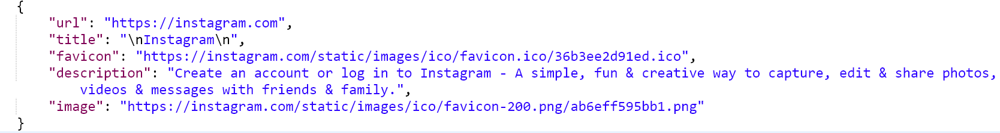

<h1 align="center">node-link-scraper</h1>

<p align="center">Simple link scraper built in node.js, required for the <b>preview-link-js</b> npm package</p>

<p>This scraper is a requirement to be able to run link previews. Client-side web scraping is not possible, as you must supply CORS headers to make the request. Additional information here: <a href="https://developer.mozilla.org/en-US/docs/Web/HTTP/CORS">Cross-Origin Resource Sharing (CORS)</a></p>

## Installation
- Clone repo and deploy server </br>
- Scraper link must be supplied to <b>preview-link-js</b> component </br>
- Can be added to an existing node server

## Environment Variables
- To prevent unauthorized usage, you can whitelist your site by setting the variable `WHITELIST` </br>
- This server automatically runs on port 8080. If you are operating on a different port, set the variable `PORT`
```
SET WHITELIST=rishabr17.github.io
SET PORT = 3000
node index.js
```

## Usage
- If you would like to use this scraper outside of the <b>preview-link-js</b> component, simply make a `POST` request containing the url in JSON: `{ "text": "www.instagram.com" }` </br>
- Response:
</img>
